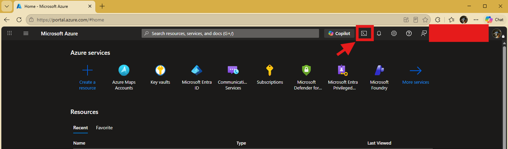
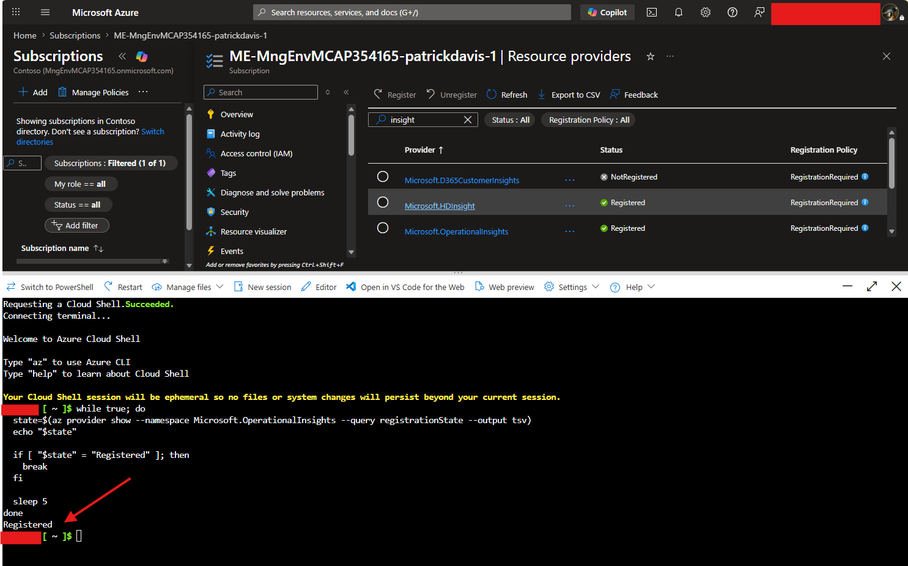
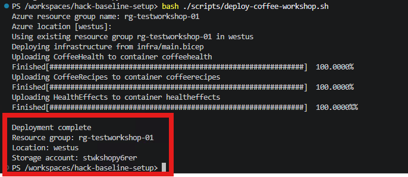
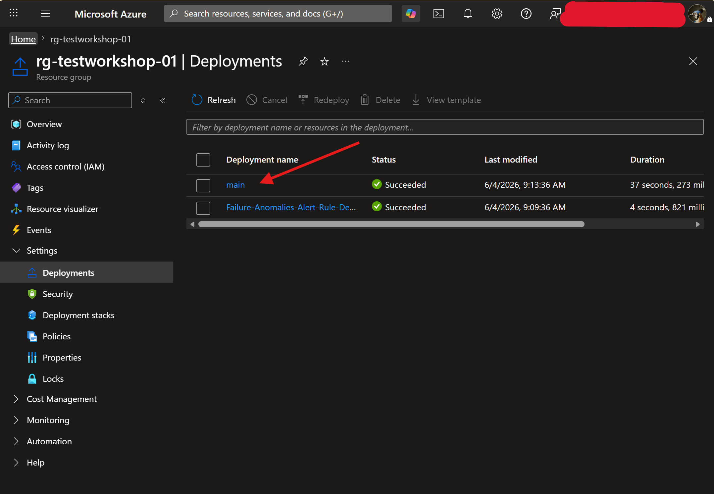
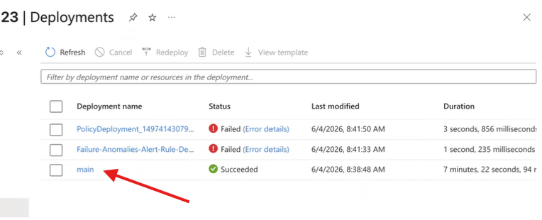
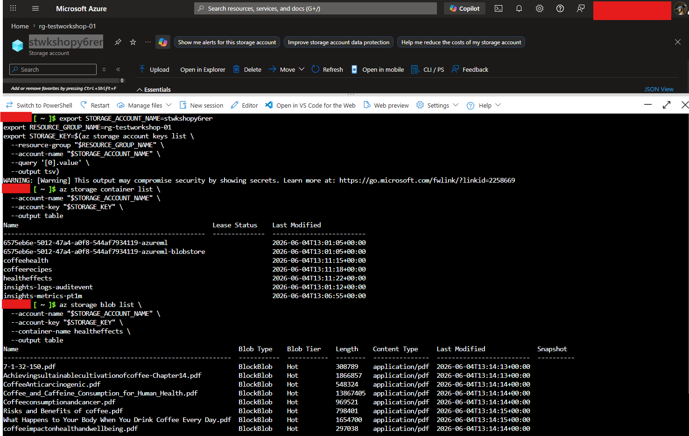

# Azure AI PNNL TechFest Deployment Guide

## Optional Learning (Not Required)

These resources are optional, but they can help participants get comfortable with the Azure portal before starting the deployment steps.

- [Navigating the Azure portal - YouTube](https://www.youtube.com/watch?v=BDbiQ6kXbUE)
- [Microsoft Azure - Using the Global Search - GeeksforGeeks](https://www.geeksforgeeks.org/devops/microsoft-azure-using-the-global-search/)
- [Use the Azure portal and Azure Resource Manager to Manage Resource Groups - Azure Resource Manager: Microsoft Learn](https://learn.microsoft.com/en-us/azure/azure-resource-manager/management/manage-resource-groups-portal)
- [Get started with AI in Azure - Training: Microsoft Learn](https://learn.microsoft.com/en-us/training/modules/get-started-with-ai-in-azure/)


## Setup PreReq for the Workshops

This guide walks through deploying this repository into Azure from Azure Cloud Shell.

> If you are looking to set up the model deployments, Follow this guide [Microsoft Foundry Model Deployment](foundry.html)


Use this guide when you want to:

- sign in to Azure
- open Azure Cloud Shell in Bash mode
- avoid creating a Cloud Shell storage account
- clone this repository
- run the deployment script
- verify that the Azure resources were created
- remove the resources when you are done

> ❗The Azure subscription will be referred to as the **Birthright Subscription** throughout this process. This is the recommended PNNL subscription for this workshop.

## Before You Start

Make sure you have:

- access to the Azure portal at <https://portal.azure.com>
- A provisioned Birthright Subscription
- permission to create a resource group and Azure AI resources
- enough quota in your selected Azure region for Azure AI Foundry, Azure AI Search, Azure OpenAI, Storage, and Application Insights

This repository is deployed with the following tested commands:

```bash
git clone https://github.com/Patrick-Davis-MSFT/hack-baseline-setup.git

cd ./hack-baseline-setup

bash ./scripts/deploy-coffee-workshop.sh
```

The script will prompt you for:

- an Azure resource group name
- an Azure location, with `westus` as the default

When the script completes, it deploys the infrastructure in `infra/main.bicep` and uploads the workshop data from `data/Coffee` into blob containers in the new storage account.

## 1. Logging into Azure and Opening Cloud Shell

1. Open the Azure portal at <https://portal.azure.com>.
2. Sign in with the account you will use for the workshop.
3. Confirm that you can access the **Birthright Subscription**.
4. In the Azure portal top bar, select the **Cloud Shell** icon.



5. When prompted to choose a shell, select **Bash**. (If asked, create the new cloudshell without VNET or a storage account)
> If Cloud Shell prompts you to create a storage account or mount a file share, do **not** create one for this walkthrough. Instead, choose the temporary or ephemeral session option if it is shown in your portal experience.
6. Wait for the Bash prompt to open.

Notes:

- The Cloud Shell portal experience can change over time. In some portal versions, the temporary option is labeled as an ephemeral or no-storage session.
- In this walkthrough, the goal is to use Cloud Shell without creating a dedicated storage account for Cloud Shell itself.
- Files in an ephemeral Cloud Shell session are temporary, so complete the deployment steps in one sitting.

After Cloud Shell opens, confirm that you are working against the correct subscription.

Run:

```bash
az account show --output table
```

Review the output and confirm that the active subscription is the **Birthright Subscription**.

If it is not, list the subscriptions available to you:

```bash
az account list --output table
```

Then set the active subscription:

```bash
az account set --subscription "Birthright Subscription Name"
```

Run this command again to verify the change:

```bash
az account show --output table
```


## 2. Register Operational Insights Provider

Run this command to register the Operational Insights provider. No Output is expected.

```bash
az provider register --namespace Microsoft.OperationalInsights
```

Then use this Bash loop to wait until the provider registration completes. If you get an error, contact the PNNL Azure Admin.

```bash
while true; do
  state=$(az provider show --namespace Microsoft.OperationalInsights --query registrationState --output tsv)
  echo "$state"

  if [ "$state" = "Registered" ]; then
    break
  fi

  sleep 5
done
```



## 3 Running the Setup Script

In Azure Cloud Shell, run the following commands exactly as shown.

### Step 3.1 Clone the Repository

```bash
git clone https://github.com/Patrick-Davis-MSFT/hack-baseline-setup.git
```

This downloads the repository into your current Cloud Shell session.

### Step 3.2 Change into the Repository Folder

```bash
cd ./hack-baseline-setup
```

### Step 3.3 Start the Deployment Script

```bash
bash ./scripts/deploy-coffee-workshop.sh
```

### Step 3.4 Respond to the Script Prompts

The script asks for two values.

First prompt:

```text
Azure resource group name:
```

Enter a new resource group name for the workshop. Example:

> ❗Note: **DO NOT** name your resource group `pnnl-techfest-coffee-rg`. This is only a place holder, You 💥**will**💥 get an error.

```text
pnnl-techfest-coffee-rg
```

After you choose your resource group name, save it in a Bash variable so the remaining commands are easy to reuse.

```bash
export RESOURCE_GROUP_NAME="your-resource-group-name"
```

Second prompt:

```text
Azure location [westus]:
```

You can press `Enter` to accept `westus`, or type a different Azure region if your Birthright Subscription requires another supported region.

Example using the default:

```text
westus
```

If you want to reuse the location later in Bash commands, save it as a variable too.

```bash
export LOCATION="westus"
```

> We reccommend westus, westus3, southcentralus

What the script does next:

1. Verifies that you are signed in to Azure with the Azure CLI.
2. Creates the resource group if it does not already exist.
3. Deploys the Bicep template from `infra/main.bicep`.
4. Reads the storage account name returned by the deployment.
5. Uploads the contents of each folder under `data/Coffee` into matching blob containers.

During a successful deployment, you should see output similar to this:

```text
Creating resource group pnnl-techfest-coffee-rg in westus
Deploying infrastructure from infra/main.bicep
Uploading CoffeeHealth to container coffeehealth
Uploading CoffeeRecipes to container coffeerecipes
Uploading HealthEffects to container healtheffects

Deployment complete
Resource group: pnnl-techfest-coffee-rg
Location: westus
Storage account: stwkshopxxxxx
```

Record these values before closing Cloud Shell:

- resource group name
- location
- storage account name

You will use them in the verification and teardown steps.



## 4. Verify the Resources Exist

After the script completes, verify that the deployment created the expected resources.

Errors and deployment status can be seen in the Deployments blade of the resource group.



> Note Often PNNL sites may get errors for Policy related deployments, These are normal. *ONLY* the deploymnet `main` is used for this workshop 

### Step 4.1 Confirm the Resource Group Exists

Replace the resource group name below with the name you entered earlier.

```bash
az group show --name "$RESOURCE_GROUP_NAME" --output table
```

If the command succeeds, the resource group exists.

### Step 4.2 List the Resources in the Resource Group

```bash
az resource list --resource-group "$RESOURCE_GROUP_NAME" --output table
```

You should see resources similar to these:

- a storage account
- an Azure AI Search service
- an Application Insights instance

### Step 4.3 Check the Deployment Status

```bash
az deployment group list --resource-group "$RESOURCE_GROUP_NAME" --output table
```

You should see at least one successful resource group deployment.

### Step 4.4 Verify the Blob Containers Were Uploaded

If your storage account name from the script output was `stwkshopxxxxx`, retrieve a storage account key:

> Note the storage account name is dynamically generated

```bash
export STORAGE_ACCOUNT_NAME=stwkshopxxxxx
export RESOURCE_GROUP_NAME="your-resource-group-name"
export STORAGE_KEY=$(az storage account keys list \
  -g "$RESOURCE_GROUP_NAME" \
  -n "$STORAGE_ACCOUNT_NAME" \
  --query '[0].value' \
  --output tsv)
```

Then list the containers:

```bash
az storage container list \
  --account-name "$STORAGE_ACCOUNT_NAME" \
  --account-key "$STORAGE_KEY" \
  --output table
```

You should see these containers:

- `coffeehealth`
- `coffeerecipes`
- `healtheffects`

To verify that files were uploaded, list blobs in one of the containers:

```bash
az storage blob list \
  --account-name "$STORAGE_ACCOUNT_NAME" \
  --account-key "$STORAGE_KEY" \
  --container-name healtheffects \
  --output table
```



## 5. Teardown of the Resources (After the Workshop)

When the Azure AI PNNL TechFest walkthrough is complete, remove the workshop resources so they do not continue to consume quota or cost.

This repository deploys all Azure resources into a single resource group, so the simplest teardown is to delete that resource group.

### Step 5.1 Delete the Resource Group

```bash
az group delete --name pnnl-techfest-coffee-rg --yes
```

If you want the command to return immediately while Azure continues deletion in the background, use:

```bash
az group delete --name pnnl-techfest-coffee-rg --yes --no-wait
```

### Step 5.2 Confirm the Resource Group Was Removed

Run:

```bash
az group exists --name pnnl-techfest-coffee-rg
```

Expected result after deletion finishes:

```text
false
```

## Workshops
* Workshop 1 Link [Microsoft Foundry Knowledge Base](comming-soon.html)
* Workshop 2 Link [Microsoft Foundry Agents](comming-soon.html)
