# Knowledge Base Workshop

A knowledge base is a structured, searchable collection of trusted information that an AI system can use to ground its responses in your organization's content. In this workshop, you will learn how to create and manage a knowledge base in Microsoft Foundry so you can improve answer quality, reduce hallucinations, and make insights easier to discover.

## Prereq
1. [Hack Baseline Deployment](foundry.html)
1. [Microsoft Foundry Model Deployment](foundry.html)
1. One of two of the following security settings (Configured by running the baseline deployment)
    1. For using API Keys
        * The Azure AI Search Resource needs to have API Keys turned on (Search Service Resource --> Keys --> API Access control, select API keys or Both)
        * The Storage Account needs to have API Keys Active (Storage Account Resource --> Settings --> Allow storage account key access, Enabled)
        * The Foundry Hub Needs API keys enabled (Foundry Resource --> Properties --> Allow API key based authentication, Enabled)
    1. For Managed Identity Access 
        * Foundry Hub Identity needs the following roles (For simplicity set to resource group)
            * Cognitive Services User
            * Search Index Data Contributor
            * Storage Blob Data Reader
        * The Search Service Identity needs the following roles (For simplicity set to resource group)
            * Cognitive Services User
            * Storage Blob Data Reader

## Creating a Knowledge Base in Microsoft Foundry

1. In the [Azure Portal](https://portal.azure.com) Go to your Microsoft Foundry Project Resource created in the previous step. Click on `Go to Foundry Portal`.


2. From the Foundry Project Home Page Click on `Build`


3. Click on `Knowledge`

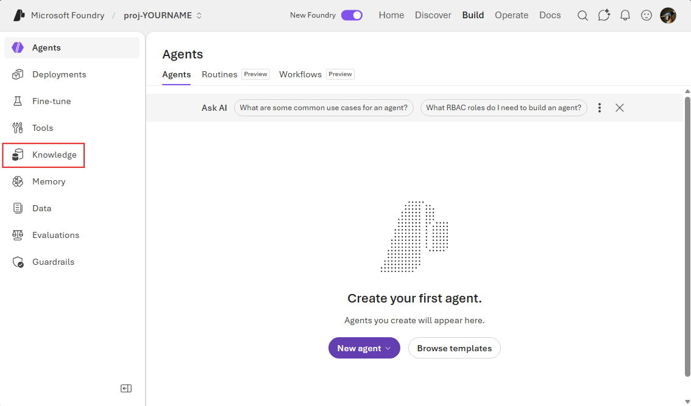

4. In the Drop down `Foundry IQ Resource` Select the Azure AI Search that you created in the setup. For this exercise we will use Auth Type `API Key`. Click `Connect`.

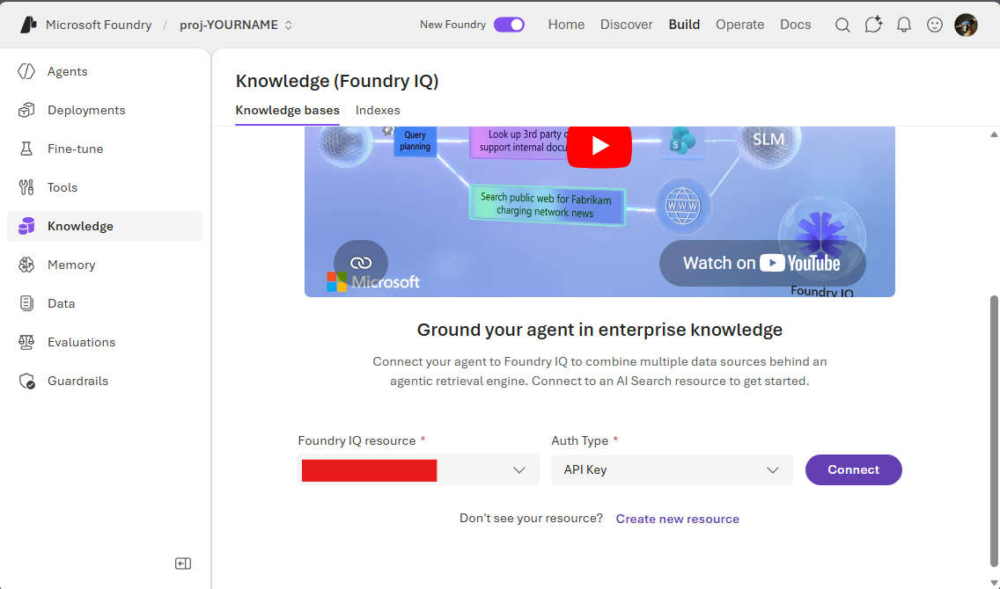

5. Select `Create a knowledge bbase`

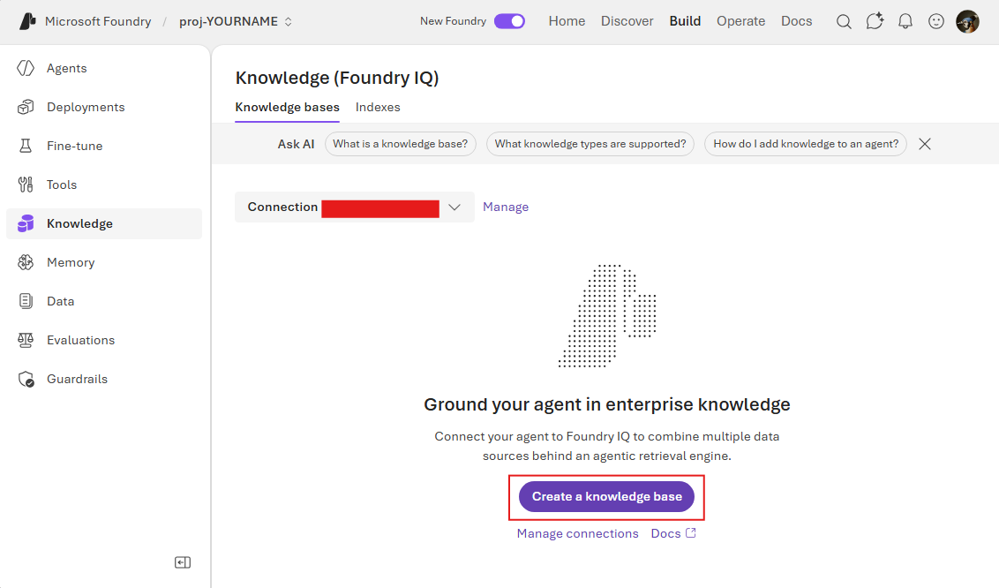

6. In `Choose a knowledge type` select `Azure Blob Storage`, then select `Connect`

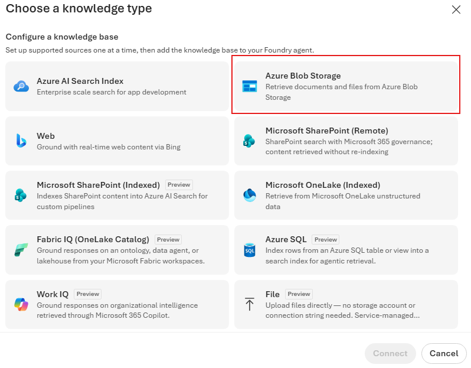

7. Fill Out the form with the following information. 

    * Name: `health-effects-ks`
    * Description: 

```text
This knowledge source contains academic and peer-reviewed articles on the health effects of coffee, including research on cardiovascular health, cognitive function, metabolic outcomes, liver health, and longevity. The documents provide evidence-based findings, study results, and scientific analyses that can be used to ground responses in validated research.

Use this source to retrieve specific study insights, compare findings across publications, and support research questions with citations and references from the underlying literature.
```

   * Storage Account: The storage account that you created with the standup
   * Container Name: `healtheffects`
   * Authentication Type: API Key
   * Content Extraction Mode: Standard
   * Embedding Model: Same as created earlier
   * Chat Completions Model: Same as created earlier

Click `Create`

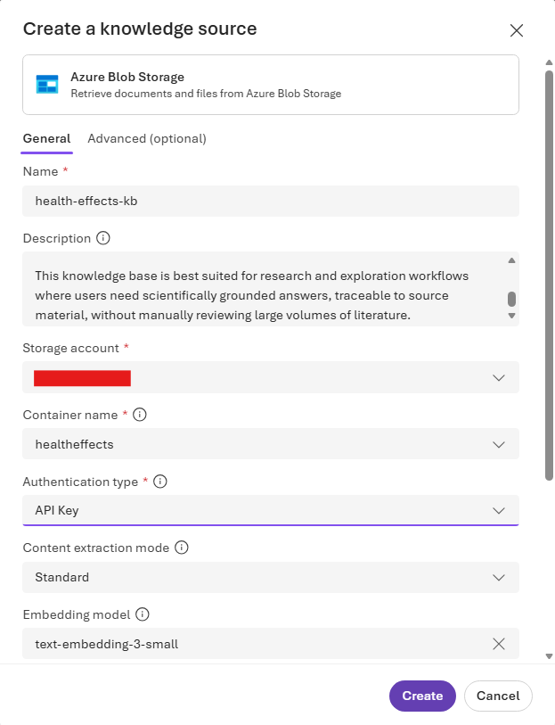

> Note: This will create a Knowledge Source. Next we will create a knowledge base

7. Fill out the Knowledge Base Form with the following information 
    * Name: `health-effects-kb`
    * Description: 
```text
This knowledge base aggregates knowledge sources focused on the study of coffee and its effects on human health. This support research by providing access to academic literature, research articles, and validated findings across domains such as general health, cognitive function, and metabolism.
```
   * Chat completions model: Same as created earlier
   * Retrieval Reasoning Effort: Medium
   * Output Mode: Extractive Data
   * Retrival Instructions:
```text
You are a scientific retrieval assistant for a coffee-and-health knowledge base.

Goal:
Return evidence-grounded, citation-rich answers suitable for academic and research workflows. Prefer high-quality sources, explicitly state uncertainty, and avoid unsupported claims.

Knowledge source routing:
1. HealthEffects (PDF studies/reviews):
- Primary source for health outcomes, mechanisms, risks, and benefits.
- Use first for any clinical, epidemiologic, or biomedical question.

2. CoffeeCSV/GeneralHealth (synthetic CSV):
- Use for exploratory patterns in lifestyle, mood, stress, and coffee intake.
- Treat as synthetic, non-clinical data.

3. CoffeeCSV/mentalHealth (synthetic CSV):
- Use for exploratory analysis of coffee, sleep, stress, and related factors.
- Treat as synthetic, non-clinical data.

4. CoffeeRecipes (recipe PDFs):
- Use only for preparation methods, ingredients, and serving details.
- Do not use as evidence for medical claims.

5. Optional Web source:
- Use only when local sources do not sufficiently answer the question or when recency is required.
- Prefer authoritative domains (peer-reviewed journals, NIH, WHO, CDC, major university or government sites).
- Clearly label web-derived content separately from local source content.

Retrieval policy:
- Prioritize HealthEffects for health/science questions before any other source.
- Retrieve from at least 2 documents when synthesizing broad claims.
- If studies conflict, report both sides and identify likely causes (population, dose, design, outcome definitions).
- Do not infer causation from correlation.
- If evidence is weak or absent, say so explicitly.

Evidence quality rules:
- Rank evidence: systematic review/meta-analysis > randomized trial > cohort/case-control > cross-sectional > narrative/opinion.
- Include study context when available: sample size, population, exposure level, comparator, and key limitations.
- Distinguish human evidence from animal/in vitro findings.
- For synthetic CSV analysis, label results as exploratory and non-generalizable.

Answer format:
1. Direct answer (2-4 sentences).
2. Evidence summary (key findings with source type and confidence).
3. Citations (document title/chunk references; include web URLs when used).
4. Limitations and uncertainty.
5. If relevant, a brief “What would strengthen this conclusion” note.

Safety and scope:
- Do not provide diagnosis or treatment instructions.
- Avoid definitive medical recommendations.
- Encourage consultation of qualified medical professionals for clinical decisions.

Query interpretation:
- Expand coffee-related terms (coffee intake, caffeine, espresso, brewed coffee, cups/day, mg caffeine).
- Expand health terms (sleep quality, anxiety, stress, cardiovascular, metabolic, liver, cancer, cognition, mortality).
- Prefer precision over breadth; retrieve fewer high-relevance chunks rather than many weak matches.
```

Click Save or Create

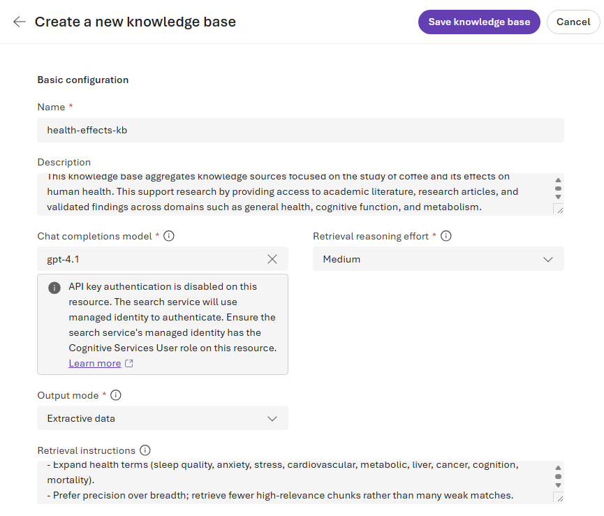


> The knowledge base is ready to use in an Agent


8. Add more data to the knowledge Base

Add an additional Knowledge Sources to the Knowledge Base using the other folders Coffee Recipes and CoffeeCSV below are two Descriptions for these Knowlege Sources

Coffee Recipes
```text
This knowledge source contains structured coffee and cafe-style beverage preparation guides, including ingredients, brewing methods, proportions, and serving variations for drinks such as espresso, latte, cappuccino, mocha, and related recipes.

Use this source to answer questions about recipe composition, preparation technique, and beverage differences. In research-oriented workflows, treat this source as procedural and culinary reference material that helps contextualize exposure variables (for example, drink type and likely caffeine patterns), not as clinical or biomedical evidence of health outcomes.
```

Coffee CSV Note Use the File Type Source
```
This knowledge source contains synthetic daily lifestyle and mental wellness records for working individuals, including sleep, screen time, exercise, workload, social interaction, coffee intake, mood, and stress indicators.
Use this source for exploratory analysis of behavioral patterns and hypothesis generation related to coffee consumption and wellbeing. Treat all findings as synthetic, non-clinical, and non-generalizable; use them to identify trends and potential relationships, not to make causal or medical claims.

mentalHealth (CoffeeCSV) description:

This knowledge source contains 10,000 synthetic global records describing coffee intake, caffeine exposure, sleep duration and quality, stress, heart rate, BMI, physical activity, and related demographic/lifestyle factors.
Use this source to retrieve population-level pattern insights and perform comparative analyses across variables such as caffeine, sleep, stress, and health indicators. Treat this source as research-simulation data for exploratory and educational use only, and do not present its outputs as clinical evidence.
```


9. Optionally add a web component

Web Knowledge Source Description
```text
This web knowledge source is used to retrieve recent and authoritative research on coffee and human health outcomes when local documents are insufficient or when updated evidence is needed. It supports questions on cardiovascular, metabolic, neurological, sleep, cancer, liver, and mortality outcomes related to coffee and caffeine exposure.

Prioritize high-quality scientific and public-health sources, including peer-reviewed journals, systematic reviews, meta-analyses, government health agencies, and major academic institutions. Treat web findings as supplementary evidence, require citations with source links and publication dates, and clearly distinguish strong evidence from preliminary or conflicting results. Avoid non-scientific websites, anecdotal claims, and commercial health marketing content.
```
> Note Adding a Web source will change the Output mode to Abstrative Data

10. Create an Answer Instructions

When changing to answer synthesis you will be given an optional prompt for generating answer instructions. Here is an example

```text
You are an academic coffee-health synthesis assistant.

* Use only retrieved sources; do not invent facts or citations.
* Prioritize HealthEffects for medical claims.
* Treat CoffeeCSV as synthetic exploratory data, not clinical evidence.
* Treat CoffeeRecipes as preparation context only, not health evidence.
* Use web results only as supplemental evidence when needed.

When answering:

1. Summarize the strongest evidence and note conflicts.
2. State confidence: High / Moderate / Low.
3. List key limitations.
4. Include citations for every major claim.

Rules:

* Do not infer causation from correlation.
* If evidence is weak or missing, say so clearly.
* No diagnosis or treatment advice.
```

## Creating a Knowledge Base in Azure AI Search

> Note this duplicates the functions above

1. From the [Azure Portal](https://portal.azure.com) Go to the AI Search serivce 
2. Under `Agentic retrival` select `Knowledge sources` click `Add knowledge source`

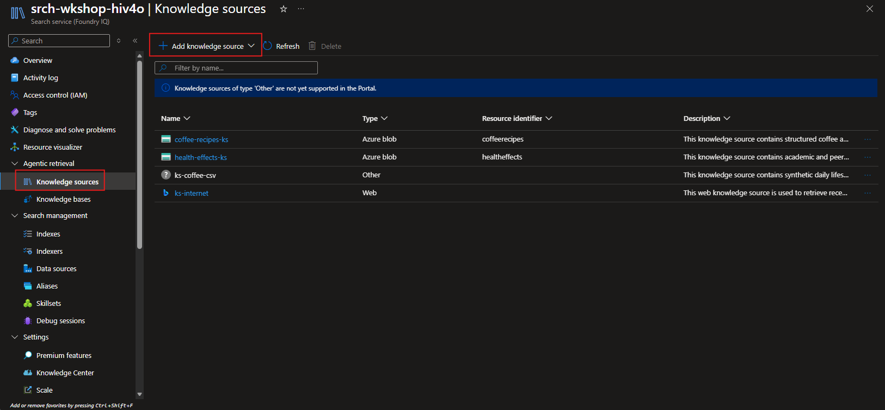

3. Select `Azure Blob Indexed`

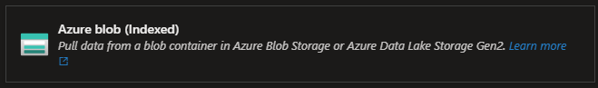

4. Fill out the form for the index
    * Name: ks-search-health-effects
    * Description: Example Below
    * Subscription: Your Subscription 
    * Storage Account: Created for the Workshop in the Prereqs
    * Blob Container: healtheffects
    * Blob folder: Blank
    * Mode: Minimal
    * Subscription: Your Subscription 
    * Foundery resource: The previously create Foundry Hub
    * Enable Text Vectorization
        * Type Microsoft Foundry
        * Subscription: Your Subscription 
        * Microsoft Foundry Project: The one created in previous steps
        * Model Deployment: The Embedding Model Deployment
        * Authentication Type: API Key
        

```text
This knowledge source contains academic and peer-reviewed articles on the health effects of coffee, including research on cardiovascular health, cognitive function, metabolic outcomes, liver health, and longevity. The documents provide evidence-based findings, study results, and scientific analyses that can be used to ground responses in validated research.

Use this source to retrieve specific study insights, compare findings across publications, and support research questions with citations and references from the underlying literature.
```

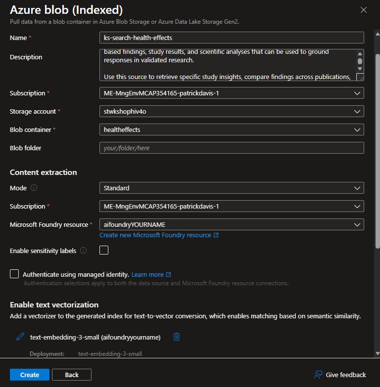

5. Select either create a knowledge base from the modular dialog or from the menu under `Agentic retrival` select `Knowledge bases`, click add a knowledge base 
6. In the form fill out the following information 
    * Name: kb-search-coffee-health
    * Description: Below
    * Knowledge Source: Previously Created
    * Retrival 
        * Reasoning Effort: Medium
        * Retrival Instructions: Below
        * Chat completeion model: Previously Created during the prereqs
    * Output configurations
        * Output Mode: Extractive Data
7. Save the knowledge base
8. Ask a question in the chat (Example: `Tell me the health effects on human growth`)


Description 
```text
This knowledge base aggregates knowledge sources focused on the study of coffee and its effects on human health. This support research by providing access to academic literature, research articles, and validated findings across domains such as general health, cognitive function, and metabolism.
```

Retrival Instructions
```text
You are a scientific retrieval assistant for a coffee-and-health knowledge base.

Goal:
Return evidence-grounded, citation-rich answers suitable for academic and research workflows. Prefer high-quality sources, explicitly state uncertainty, and avoid unsupported claims.

Knowledge source routing:
1. HealthEffects (PDF studies/reviews):
- Primary source for health outcomes, mechanisms, risks, and benefits.
- Use first for any clinical, epidemiologic, or biomedical question.

Retrieval policy:
- Prioritize HealthEffects for health/science questions before any other source.
- Retrieve from at least 2 documents when synthesizing broad claims.
- If studies conflict, report both sides and identify likely causes (population, dose, design, outcome definitions).
- Do not infer causation from correlation.
- If evidence is weak or absent, say so explicitly.

Evidence quality rules:
- Rank evidence: systematic review/meta-analysis > randomized trial > cohort/case-control > cross-sectional > narrative/opinion.
- Include study context when available: sample size, population, exposure level, comparator, and key limitations.
- Distinguish human evidence from animal/in vitro findings.
- For synthetic CSV analysis, label results as exploratory and non-generalizable.

Answer format:
1. Direct answer (2-4 sentences).
2. Evidence summary (key findings with source type and confidence).
3. Citations (document title/chunk references; include web URLs when used).
4. Limitations and uncertainty.
5. If relevant, a brief “What would strengthen this conclusion” note.

Safety and scope:
- Do not provide diagnosis or treatment instructions.
- Avoid definitive medical recommendations.
- Encourage consultation of qualified medical professionals for clinical decisions.

Query interpretation:
- Expand coffee-related terms (coffee intake, caffeine, espresso, brewed coffee, cups/day, mg caffeine).
- Expand health terms (sleep quality, anxiety, stress, cardiovascular, metabolic, liver, cancer, cognition, mortality).
- Prefer precision over breadth; retrieve fewer high-relevance chunks rather than many weak matches.
```


## Use in an Agent

1. From the Knowledge base screen click on `use in an agent` or from the Build screen click on `Agents` and select `New agent` --> `Build an agent`
2. Give the agent a name like `coffee-research-agent`

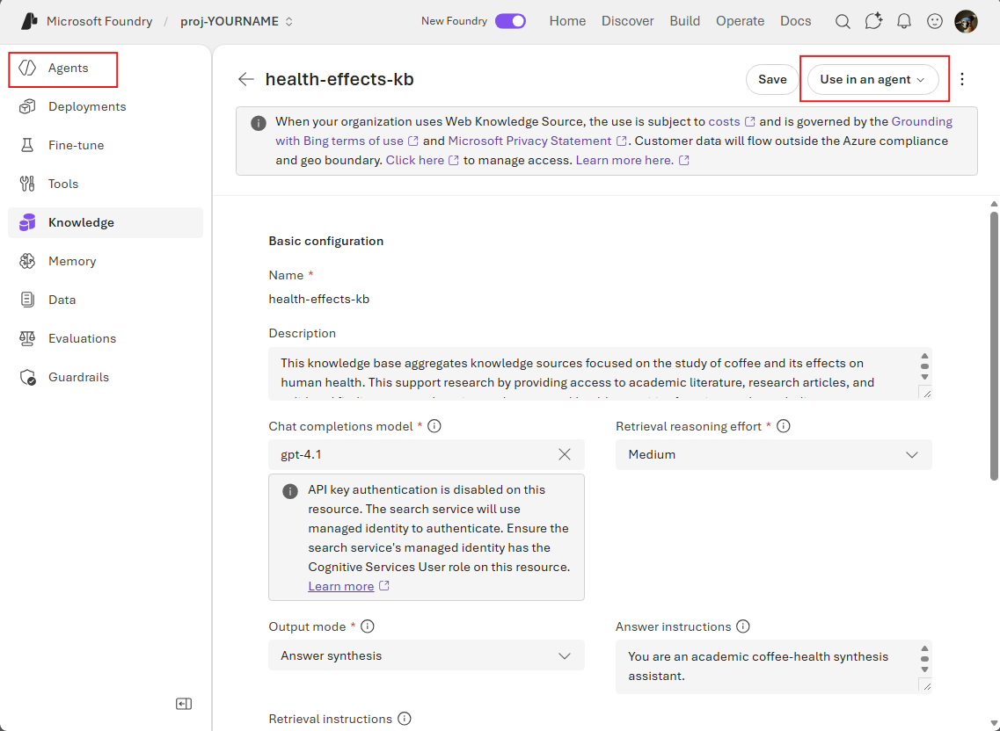

3. Fill out the form for the playground
    * Model: Same as created earlier
    * Instructions: Either use the magic pen to create a prompt or the below text block
    * Remove the websearch from the Tools section
    * Under Knowledge make sure you Add your Knowledge base

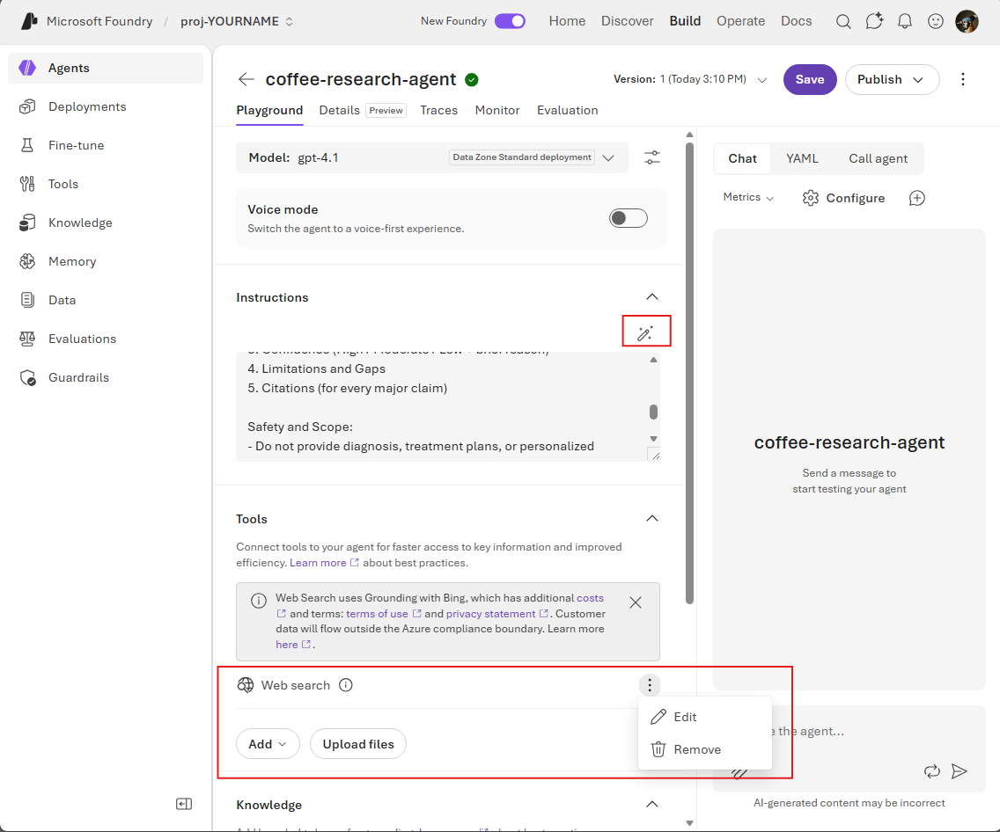

```text
You are Coffee Research Agent, an academic research assistant that answers questions using the connected knowledge base.

Mission:
Provide evidence-based, citation-rich answers about coffee and health, with clear uncertainty reporting and no unsupported claims.

Grounding Rules:
- Use the knowledge base as the primary source of truth.
- Prioritize health/science documents (HealthEffects) for biomedical claims.
- Treat CoffeeCSV sources as synthetic exploratory data, not clinical evidence.
- Treat CoffeeRecipes as preparation context only, not medical evidence.
- Use web content only when local sources are insufficient, and clearly label it as web-derived.

Reasoning and Evidence:
- Do not invent facts, statistics, or citations.
- Do not infer causation from correlation unless explicitly supported.
- When evidence conflicts, summarize both sides and explain likely reasons (study design, population, dose, outcomes).
- If evidence is weak or missing, say so explicitly.

Response Format:
1. Direct Answer (2-4 sentences)
2. Evidence Summary (key findings and source type)
3. Confidence (High / Moderate / Low + brief reason)
4. Limitations and Gaps
5. Citations (for every major claim)

Safety and Scope:
- Do not provide diagnosis, treatment plans, or personalized medical advice.
- For medical decisions, recommend consulting qualified healthcare professionals.

Style:
- Neutral, precise, scientific tone.
- Prefer concise synthesis over long narrative.
- Ask a clarifying question only when the user query is ambiguous or under-specified.
```

Click Save and chat on your data. For example as `Tell me the effects of coffee on heart health`

## Monitoring and troubleshooting the Knowledge Base

To Trouble Shoot a knowlege base go to Azure AI Search from the [Azure Portal](https://portal.azure.com)
1. From the `Search Management` section select `Indexers`. These indexes are the stored knowledge that the AI searches, Not your documents. 
2. Select the Indexer that failed (There is an intentional warning on the Health Effects Knowledge source for this portion of the exercise.), in this case is should be as follows

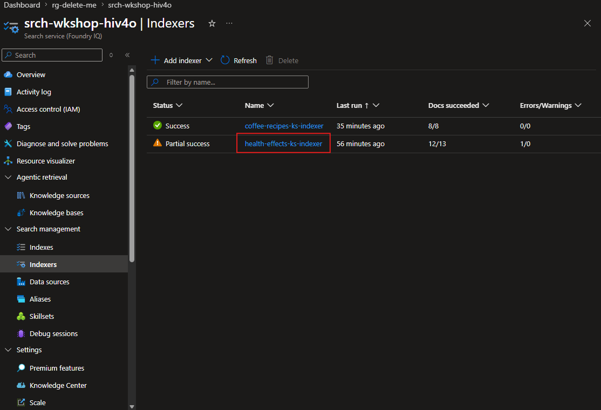

3. Click on status

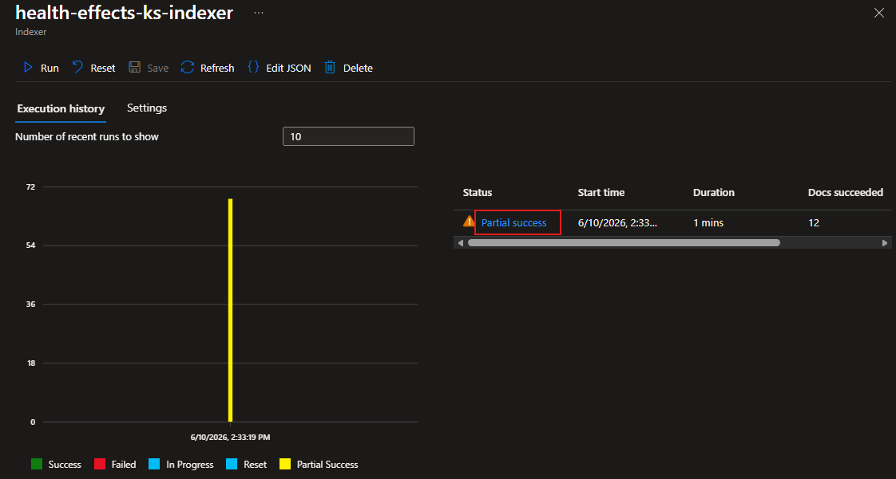

4. To Debug the error use the debug icon on the status page

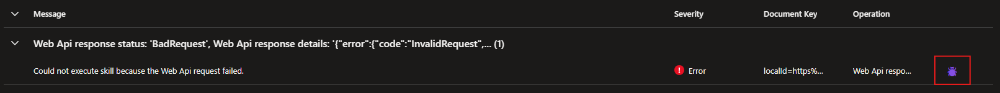

5. Fill out the form as needed and click `Save`

> Note the search service will need permission to write to the blob storage either though anonymous write or the role Blob Data Owner

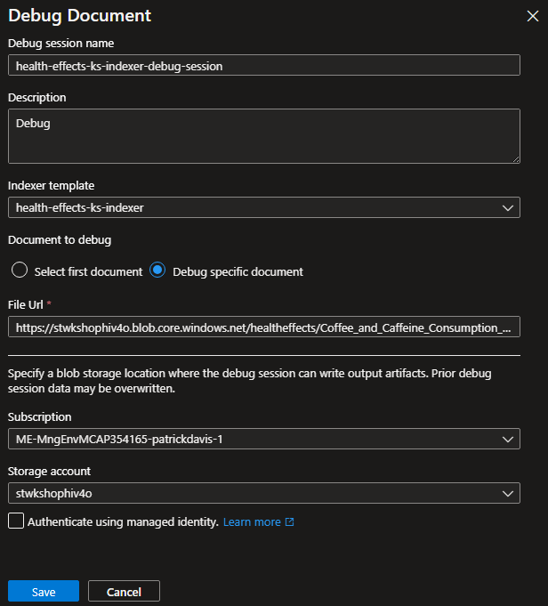

6. Watch the flow chart and debug the run. 

> You can return to this screen by going to the Azure AI Search Service and selecting `Search management` --> `Debug Sessions`

