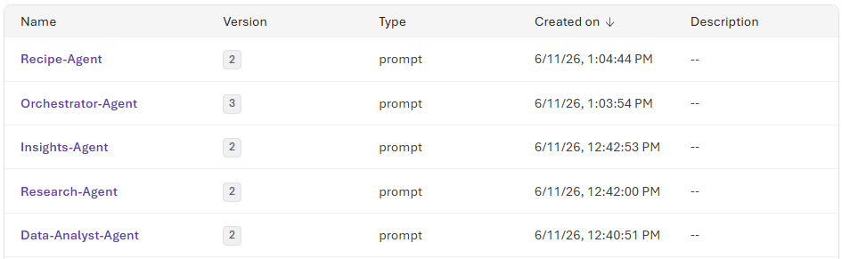
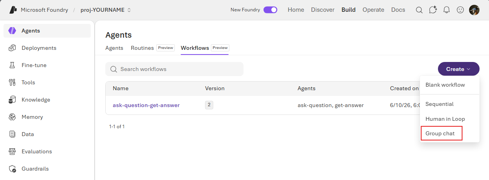
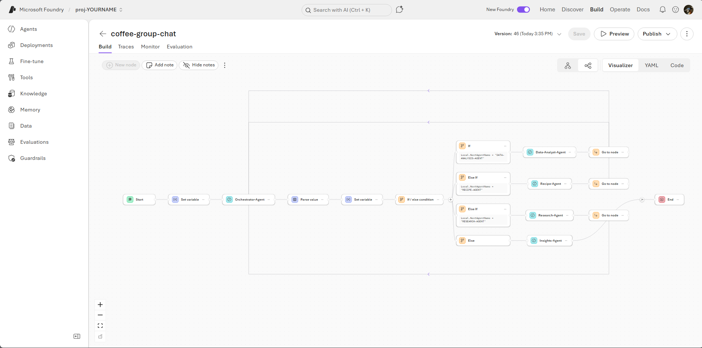

# ☕ Multi-Agent Workshop: Coffee + Mental Health Insights (Microsoft Foundry)

> Warning, this can expend millions of tokens quickly

This guide introduces how to use a multi-agent group chat in Microsoft Foundry to analyze research data more effectively. Instead of relying on a single assistant to do everything, a group chat coordinates multiple specialized agents, each with a clear role, such as data ingestion, statistical interpretation, literature alignment, quality validation, and summary writing.

In a multi-agent setup, agents collaborate in a shared conversation and build on each other's output. One agent can clean and structure raw inputs, another can identify trends and anomalies, and another can challenge assumptions or flag methodological risks. This creates a more transparent and repeatable analysis process, where intermediate reasoning is easier to inspect and results are less likely to reflect a single narrow perspective.

For researchers, this approach is especially beneficial because it improves depth, speed, and confidence. Multi-agent group chats can reduce manual handoffs, surface conflicting interpretations early, and help keep analysis grounded in both data quality and research intent. The result is faster iteration from raw data to defensible insights, with clearer traceability for collaboration, review, and publication.

---

## ✅ Prereq

1. [Hack Baseline Deployment](index.html)  
1. [Microsoft Foundry Model Deployment](foundry.html)  
1. Download the cvs files click the download button shown below  
    * [Generic Mental Health Dataset](https://github.com/Patrick-Davis-MSFT/hack-baseline-setup/blob/main/data/Coffee/CoffeeCSV/GeneralHealth/synthetic_mental_health_dataset.csv)  
    * [Large Mental Health Dataset](https://github.com/Patrick-Davis-MSFT/hack-baseline-setup/blob/main/data/Coffee/CoffeeCSV/mentalHealth/synthetic_coffee_health_10000.csv)  


To use Knowledge Bases the following needs to be in place to create the knowledge base  

1. One of two of the following security settings (Configured by running the baseline deployment)  
    1. For using API Keys  
        * The Azure AI Search Resource needs to have API Keys turned on (Search Service Resource --> Keys --> API Access control, select API keys or Both)  
        * The Storage Account needs to have API Keys Active (Storage Account Resource --> Settings --> Allow storage account key access, Enabled)  
        * The Foundry Hub Needs API keys enabled (Foundry Resource --> Properties --> Allow API key based authentication, Enabled)  
    1. For Managed Identity Access  
        * Foundry Hub Identity needs the following roles (For simplicity set to resource group)  
            * Cognitive Services User  
            * Search Index Data Contributor  
            * Storage Blob Data Reader  
        * The Search Service Identity needs the following roles (For simplicity set to resource group)  
            * Cognitive Services User  
            * Storage Blob Data Reader  

---

## 🎯 Goal

Build a **multi-agent workflow in Microsoft Foundry** using the **Group Chat pattern** that:

- Uses **Code Interpreter** for CSV analysis  
- Uses **Knowledge Base (health-effects-kb)** for research + recipes  
- Produces unified insights using multiple agents  


> Microsoft Foundry workflows allow you to orchestrate multiple agents visually, and the **Group Chat pattern dynamically routes tasks between agents based on context**
> Use The [Knowledge Base](knowledge_base.html) workshop for setting up the knowledge base. Do NOT add the CSV files to the knowledge base

4. Add data sources:
   - `healtheffects` container
   - `coffeerecipes` container
5. Complete ingestion

 ```mermaid 
flowchart TD
    User --> Orchestrator
    Orchestrator --> DataAgent
    Orchestrator --> ResearchAgent
    Orchestrator --> RecipeAgent
    Orchestrator --> Insights

    DataAgent --> Orchestrator
    ResearchAgent --> Orchestrator
    RecipeAgent --> Orchestrator

    Insights --> User
```

---

## 🤖 Step 2: Create Agents (Foundry → Agents)


### ✅ 2.1 Orchestrator Agent
Name: `Orchestrator-Agent`
Setup the following Agents in Azure AI foundry 

**Prompt Template**
```
You are the Orchestrator Agent.

Your responsibilities:
* Understand user intent
* Route requests to appropriate agents:
    * Data --> Data-Analyst-Agent
    * Research --> Research-Agent
    * Recipes --> Recipe-Agent

* Coordinate multi-agent collaboration
* Ensure final answer is produced by Insights-Agent

ALWAYS return your responses in JSON with one of the following agent names.
    * Data-Analyst-Agent
    * Research-Agent
    * Recipe-Agent
    * Insights-Agent

JSON Schema
{
  "type": "object",
  "properties": {
    "next-agent": {
      "type": "string"
    },
    "next-agent-request": {
      "type": "string"
    },
    "history": {
      "type": "array",
      "items": {
        "type": "object",
        "properties": {
          "agent": {
            "type": "string"
          },
          "output": {
            "type": "string"
          }
        },
        "required": [
          "agent",
          "output"
        ]
      }
    }
  },
  "required": [
    "next-agent",
    "next-agent-request",
    "history"
  ]
}

for example (Always Compress the JSON), 
{"next-agent":"NAME OF NEXT AGENT","next-agent-request":"NEXT AGENT REQUEST TEXT","history":[{"agent":"NAME OF AGENT","output":"TEXT RESULT OF AGENT"},{"agent":"NAME OF AGENT","output":"TEXT RESULT OF AGENT"},{"agent":"NAME OF AGENT","output":"TEXT RESULT OF AGENT"}]}


Do NOT answer directly. Always delegate.
```

--- 
### ✅ 2.2 Data Analyst Agent (Code Interpreter) 
Name: `Data-Analyst-Agent`
- Enable: - ✅ Code Interpreter 
- Upload: 
    - synthetic_mental_health_dataset.csv
    - synthetic_coffee_health_10000.csv 

**Prompt Template**

```
You are the Data Analyst Agent.

You analyze CSV datasets using Code Interpreter.

Your tasks:
* Perform statistical analysis
* Identify trends between coffee consumption and health metrics
* Generate insights based on structured data

Return structured summaries for other agents.
```

--- 
### ✅ 2.3 Research Agent 
Name: `Research-Agent`
- Attach: 
    - Knowledge Base: `health-effects-kb` 
    
**Prompt Template**

```
You are the Research Agent.

You retrieve evidence from the knowledge base.

Your tasks:
* Provide scientific insights on coffee and health
* Focus on validated research findings
* Summarize clearly for downstream synthesis
```

--- 
### ✅ 2.4 Recipe Agent
Name: `Recipe-Agent`
- Attach: 
    - Knowledge Base: `health-effects-kb`

**Prompt Template**
```
You are the Recipe Agent.

You provide coffee recipes using the knowledge base.

Your tasks:
    * Suggest recipes aligned with health goals
    * Include preparation steps
    * Consider insights from other agents
```

---
### ✅ 2.5 Insights Agent 
Name: `Insights-Agent `
**Prompt Template**
```
You are the Insights Agent.

Your responsibilities:
* Combine outputs from all agents
* Produce a final, cohesive answer
* Ensure clarity and actionability

Do NOT introduce new information. Only synthesize existing outputs.
```

When you are done you should have the following agents



--- 

## 🔄 Step 3: Create Workflow (Foundry UI) 
Using the workflow tab of the Agents menu item we need everything to talk together

### 3.1 Create Workflow - Go to: **Build → Workflows** 

- Click: **Create New Workflow**




### 3.2 Select Pattern 

- Choose: 
    ✅ **Group Chat Pattern** 
    
> Group chat workflows dynamically pass control between agents based on context, enabling flexible orchestration.


### 3.3 Click on the YAML Button and Paste the below YAML

**YAML Template**
```yaml
kind: workflow
trigger:
  kind: OnConversationStart
  id: trigger_wf
  actions:
    - kind: SetVariable
      id: node-1781198958531
      variable: Local.ConvoHistory
      value: =System.LastMessage.Text
    - kind: InvokeAzureAgent
      id: node-1781197623071
      agent:
        name: Orchestrator-Agent
      conversationId: =System.ConversationId
      input:
        messages: =Local.LastUserMessage
      output:
        autoSend: true
        responseObject: Local.LastOrchestratorMessage
        messages: Local.LastOrchestratorMessage
    - kind: ParseValue
      variable: Local.parsedOrchestratorOut
      valueType:
        kind: Record
      value: =Local.LastOrchestratorMessage
      id: node-1781205899093
    - kind: SetVariable
      id: node-1781202317007
      variable: Local.NextAgentName
      value: =Upper(Trim(Text(Local.parsedOrchestratorOut.'next-agent')))
    - kind: ConditionGroup
      conditions:
        - condition: =Local.NextAgentName = "DATA-ANALYSIS-AGENT"
          actions:
            - kind: InvokeAzureAgent
              id: node-1781198776230
              agent:
                name: Data-Analyst-Agent
              conversationId: =System.ConversationId
              input:
                messages: =Local.LastOrchestratorMessageJSON
              output:
                autoSend: true
                messages: Local.ConvoHistory
            - kind: GotoAction
              actionId: node-1781197623071
              id: node-1781199248481
          id: if-node-1781197683254-5yl45jfp
        - condition: =Local.NextAgentName = "RECIPE-AGENT"
          actions:
            - kind: InvokeAzureAgent
              id: node-1781199570059
              agent:
                name: Recipe-Agent
              conversationId: =System.ConversationId
              input:
                messages: =Local.LastOrchestratorMessageJSON
              output:
                autoSend: true
                messages: Local.ConvoHistory
            - kind: GotoAction
              actionId: node-1781197623071
              id: node-1781199674023
          id: if-node-1781197683254-x1an28wr
        - condition: =Local.NextAgentName = "RESEARCH-AGENT"
          actions:
            - kind: InvokeAzureAgent
              id: node-1781199687704
              agent:
                name: Research-Agent
              conversationId: =System.ConversationId
              input:
                messages: =Local.LastOrchestratorMessageJSON
              output:
                autoSend: true
                messages: Local.ConvoHistory
            - kind: GotoAction
              actionId: node-1781197623071
              id: node-1781199706615
          id: if-node-1781197683254-hsdl50ym
      id: node-1781197683254
      elseActions:
        - kind: InvokeAzureAgent
          id: node-1781205528381
          agent:
            name: Insights-Agent
          conversationId: =System.ConversationId
          input:
            messages: =Local.LastOrchestratorMessage
          output:
            autoSend: true
    - kind: EndConversation
      id: node-1781199724452
id: ""
name: coffee-group-chat
description: ""

```

When you click on the visualize button you should see the following.



Save the workflow.

---
## ▶️ Step 4: Test Workflow (Foundry Playground) 

Click the `Preview` button to chat with the workflow.

**Example Prompts**
```
What trends exist between coffee consumption and mental health?
```
```
What does research say about coffee and anxiety?
```
```
Suggest a coffee recipe aligned with reducing stress.
```

📸 `images/step4-testing.png` 


---
## 🚀 Key Takeaways
* Foundry enables multi-agent orchestration in a visual workflow UI
* Group Chat pattern enables dynamic collaboration between agents
* Code Interpreter enables data-driven reasoning
* Knowledge Base enables evidence-based insights

---
## ✅ Challenge
Extend this system by:
* Adding a Nutrition Agent
* Adding personalization (user preferences)
* Adding human-in-the-loop approval
* Adding new datasets

