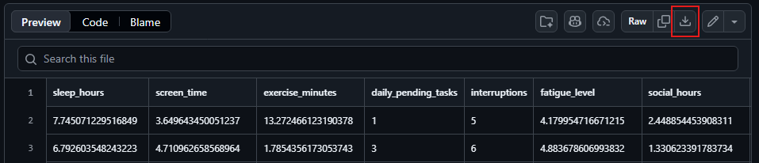
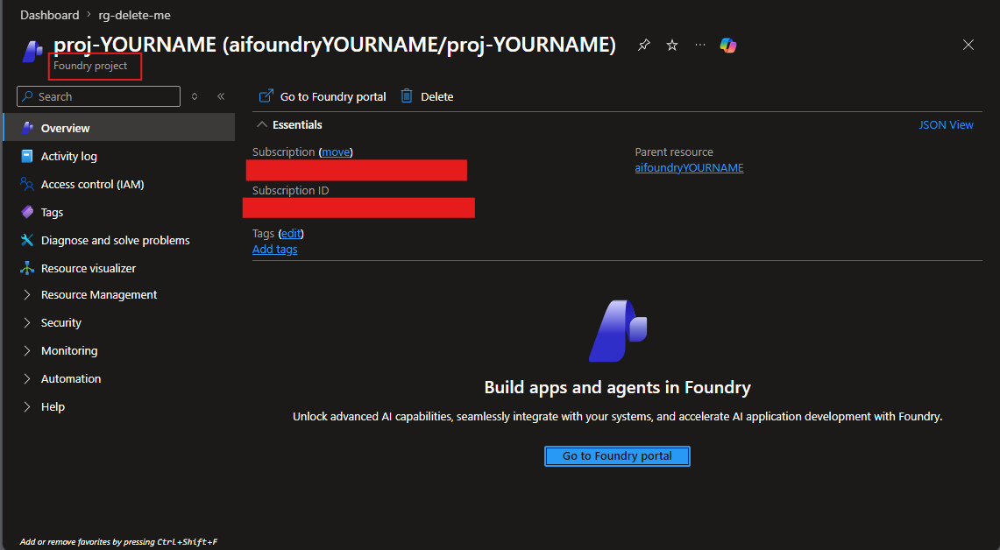
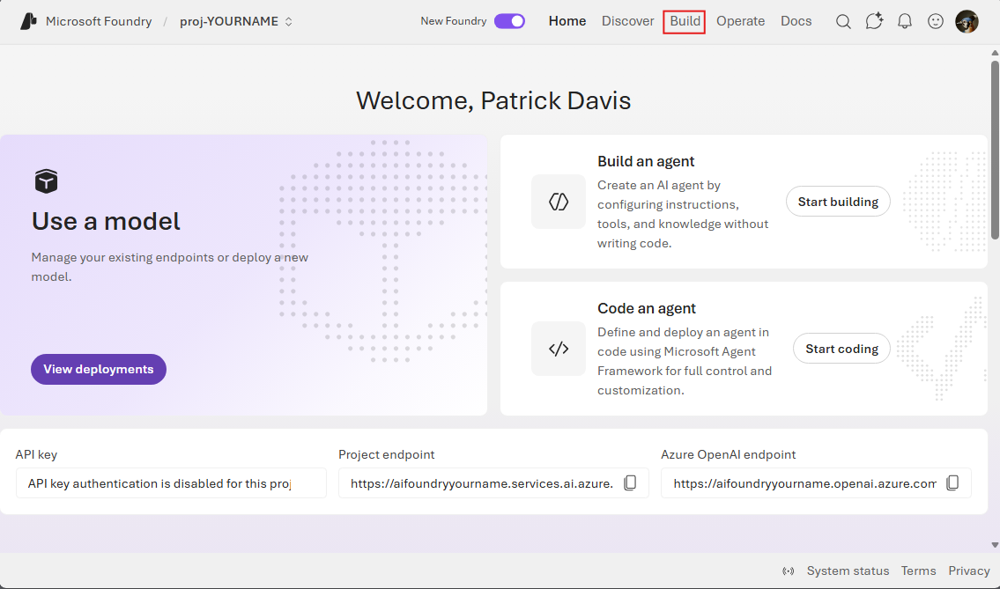
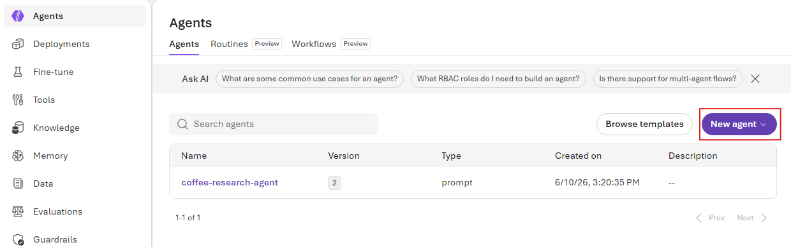
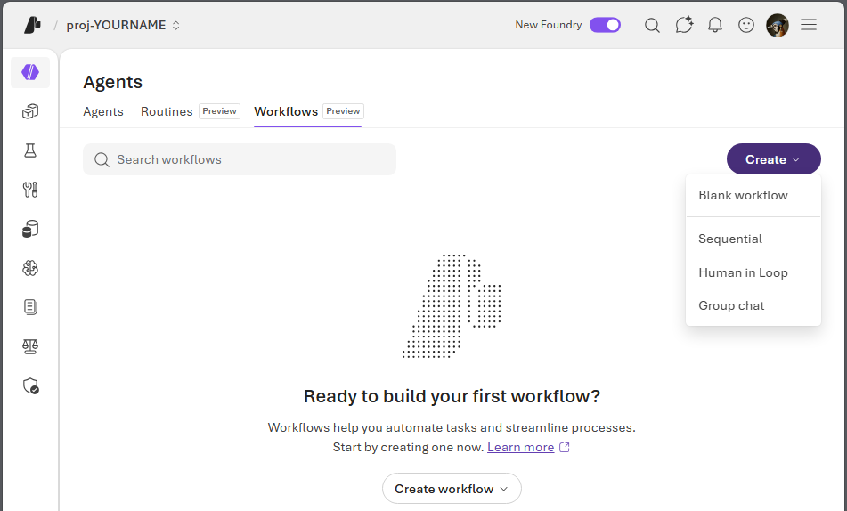

# Multi Agent Workflow in Foundry 

This walkthrough introduces a practical, end-to-end way to build and demonstrate multi-agent workflows in Azure AI Foundry. You will learn how specialized agents can collaborate to split complex tasks into focused steps, then combine their results into a single, high-value outcome. The guide is designed for workshop delivery, so each section emphasizes repeatable actions, clear checkpoints, and visible results you can share live. Along the way, you will connect model deployment, data grounding, and orchestration patterns that make agent systems reliable in real scenarios. The goal is not just to run multiple agents, but to show why role-based agent design improves accuracy, speed, and maintainability. By the end, you will have a working reference flow you can adapt for research, analysis, and business process automation. 


## Prereq
1. [Hack Baseline Deployment](index.html)
1. [Microsoft Foundry Model Deployment](foundry.html)
1. Download the cvs files click the download button shown below
    * [Generic Mental Health Dataset](https://github.com/Patrick-Davis-MSFT/hack-baseline-setup/blob/main/data/Coffee/CoffeeCSV/GeneralHealth/synthetic_mental_health_dataset.csv)
    * [Large Mental Health Dataset](https://github.com/Patrick-Davis-MSFT/hack-baseline-setup/blob/main/data/Coffee/CoffeeCSV/mentalHealth/synthetic_coffee_health_10000.csv)



To use Knowledge Bases the following needs to be in place to create the knowledge base
1. One of two of the following security settings (Configured by running the baseline deployment)
    1. For using API Keys
        * The Azure AI Search Resource needs to have API Keys turned on (Search Service Resource --> Keys --> API Access control, select API keys or Both)
        * The Storage Account needs to have API Keys Active (Storage Account Resource --> Settings --> Allow storage account key access, Enabled)
        * The Foundry Hub Needs API keys enabled (Foundry Resource --> Properties --> Allow API key based authentication, Enabled)
    1. For Managed Identity Access 
        * Foundry Hub Identity needs the following roles (For simplicity set to resource group)
            * Cognitive Services User
            * Search Index Data Contributor
            * Storage Blob Data Reader
        * The Search Service Identity needs the following roles (For simplicity set to resource group)
            * Cognitive Services User
            * Storage Blob Data Reader


## Build a Multi-agent workflow sequental (simple)
1. In the [Azure Portal](https://portal.azure.com) Go to your Microsoft Foundry Project Resource created in the previous step. Click on `Go to Foundry Portal`.



2. From the Foundry Project Home Page Click on `Build`



3. From the Agents Page select `New agent`. Select `Build a agent` and give the agent a name like `ask-question` click create



4. On the Playground Form 
    * Model: The model created previously
    * Instructions: Copy and Paste from below
    * Save the Agent
    * Click the left arrow to go back

Instructions
```text
Based on the user's provided ask a question on that topic.
```

5. From the Agents Page select `New agent`. Select `Build a agent` and give the agent a name like `get-answer` click create


6. On the Playground Form 
    * Model: The model created previously
    * Instructions: Copy and Paste from below
    * Save the Agent
    * Click the left arrow to go back

Instructions
```text
Using all tools available answer the question provided.
```

7. Click On the `Workflows` tab and click  `Create` then `Sequential`



8. On the Build Screen 
    1. `Hide Notes`
    1. Remove the third agent
    1. Set the first agent to `ask-question`
    1. Set the second agent to `get-answer`
    1. Save the workflow as `ask-question-get-answer`


9. Click the preview and give the workflow a topic. Such as `The topic is Dogs`. Use the trace feature to see how the system created the conversation